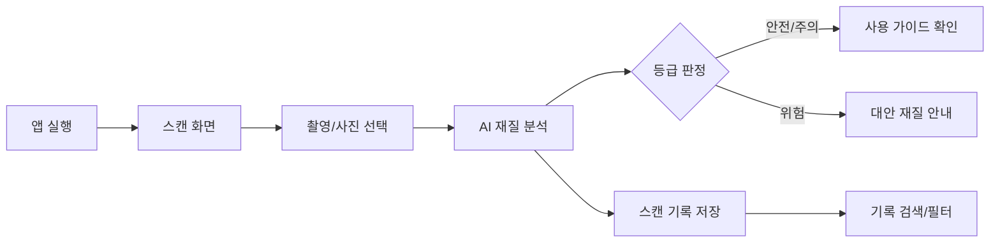

# 🍽️ WaveScan — 전자레인지 용기 안전 스캔 앱

> 라벨이 없어도, 재질을 몰라도 괜찮아요. 카메라로 비추면 AI가 3초 안에 안전 등급을 알려드립니다.

배포 링크: [바로가기](https://younsang5122.github.io/wavescan-landing/wavescan-landing)

## ✨ 주요 기능 & 인터랙션

### 1. 용기 스캔 → 3초 안전 판정
카메라 화면 중앙의 **프레임 안에 용기를 맞추고 셔터를 누르면**, 촬영된 이미지가 즉시 서버로 전송되어 AI가 재질·내열 온도·금속 성분 여부를 분석합니다. 분석 중에는 로딩 애니메이션으로 "AI 분석 중" 상태를 명확히 보여주고, 완료되면 결과 화면으로 자연스럽게 전환됩니다. 사용자가 촬영부터 결과 확인까지 화면 전환 없이 한 흐름 안에서 끝내도록 설계했습니다.

### 2. 안전·주의·위험, 3단계 등급 판정
분석 결과를 애매하게 텍스트로 나열하지 않고, **신호등처럼 직관적인 3단계(안전/주의/위험) 색상 등급**으로 정리합니다. 등급을 누르면 판정 근거(BPA Free 여부, 고온 변형 테스트, 금속 성분 감지 여부)를 체크리스트 형태로 함께 보여줘, "왜 이 등급인지" 사용자가 직접 확인할 수 있습니다.

### 3. 스캔 기록 자동 저장 및 검색
스캔할 때마다 결과와 촬영 이미지, 날짜가 Firebase Firestore에 자동 저장됩니다. 마이페이지에서 안전/주의/위험 등급별로 필터링하거나 재질명으로 검색해, 예전에 확인했던 그릇을 다시 찾아볼 수 있습니다. 매번 다시 스캔하지 않아도 "저번에 확인했던 그 그릇, 전자레인지 가능했나?"에 바로 답할 수 있도록 만든 기능입니다.

## 🧭 사용자 플로우


## 🗂️ 폴더 구조
```
src/
├── components/
│   ├── ScanFrame.jsx         # 카메라 프레임 & 셔터 UI
│   ├── GradeBadge.jsx        # 안전/주의/위험 등급 배지
│   └── ChecklistCard.jsx     # 판정 근거 체크리스트
├── screens/
│   ├── ScanScreen.jsx        # 스캔 메인 화면
│   ├── ResultScreen.jsx      # 분석 결과 화면
│   └── HistoryScreen.jsx     # 스캔 기록 조회 화면
├── functions/
│   └── analyzeMaterial.js    # 이미지 업로드 → AI 분석 요청 (Firebase Functions)
└── firebase.js                # Firebase 초기화 (Auth, Firestore, Storage)
```

## 🤖 AI 활용 프로세스
이 프로젝트는 기획 초안부터 코드 구현까지 각 단계에서 AI를 1차 초안 생성 도구로 활용하고, 그 결과를 검증·수정하는 방식으로 진행했습니다.

**① 기획 단계 — 인터뷰 기반 문제 정의**
사용자 인터뷰 요약본을 넘겨 반복되는 pain point를 뽑고 문장으로 정리해달라고 요청했습니다.
> "너는 UX 리서처야. 아래 주방 용기 사용 관련 인터뷰 요약 6건을 보고 공통적으로 반복되는 pain point 3가지를 뽑고, 각각을 'OO 사용자는 ~하기 때문에 ~하지 못한다' 형식으로 정리해줘."

AI가 뽑은 pain point 중 "용기 디자인이 마음에 안 들어 새로 산다"처럼 실제 안전성과 무관한 항목 1가지는 제외하고, "재질을 몰라 전자레인지 사용을 망설인다"는 항목을 핵심 기능 우선순위로 직접 정했습니다.

**② 디자인 단계 — 등급 색상 체계 리서치**
안전 등급을 한눈에 구분할 수 있는 색상·아이콘 기준을 세우기 위해 초안을 먼저 받았습니다.
> "안전/주의/위험 3단계를 색맹 사용자도 구분할 수 있게 표현하고 싶어. 신호등 색상 체계를 기반으로, 색상뿐 아니라 아이콘 형태로도 구분되는 등급 표시 가이드를 만들어줘."

AI가 제안한 초록·노랑·빨강 조합은 그대로 채택했지만, 제안된 아이콘 중 체크·경고·엑스 표시는 실제 목업 테스트에서 너무 작게 보여 아이콘 크기를 24px에서 32px로 직접 키웠습니다.

**③ 개발 단계 — 컴포넌트 초안 생성**
원하는 동작을 자연어로 설명해 코드 초안을 먼저 받았습니다.
> "React로 카메라 프레임 컴포넌트를 만들어줘. 셔터를 누르면 이미지를 Firebase Storage에 업로드하고, 업로드 완료 후 Firebase Functions에 분석 요청을 보내는 구조로 짜줘."

AI가 만든 초기 코드는 이미지를 원본 해상도 그대로 업로드해 업로드 속도가 느린 문제가 있어, 클라이언트 단에서 이미지를 리사이즈한 뒤 업로드하는 로직을 직접 추가해 해결했습니다.

**④ 카피라이팅 — 화면 문구 다듬기**
등급별 안내 문구도 AI로 여러 톤을 받아본 뒤 선택했습니다.
> "전자레인지 사용이 위험한 용기를 스캔했을 때 뜨는 안내 문구를 써야 해. 사용자를 놀라게 하지 않으면서도 명확하게 위험성을 전달하는 문구 2개를 제안해줘."

AI가 제안한 "위험! 절대 사용 금지!!" 같은 다소 자극적인 문구는 톤이 맞지 않아 제외하고, "이 재질은 가열 시 유해물질이 나올 수 있어요. 다른 용기를 사용해 주세요"처럼 이유를 함께 설명하는 문구로 직접 수정했습니다.

**⑤ 트러블슈팅 — 원인 진단**
버그가 발생했을 때도 증상을 설명해 원인 후보를 먼저 받아본 뒤, 실제 원인을 좁혀 나갔습니다. (아래 트러블슈팅 표 참고)

## 🩹 트러블슈팅
| 이슈 | 원인 | 해결 |
|---|---|---|
| 저사양 기기에서 스캔 화면 진입 시 카메라 미리보기 렌더링 지연 | 고해상도 카메라 스트림을 그대로 렌더링 | 프리뷰용 해상도를 별도로 낮춰 렌더링, 촬영 시에만 원본 해상도 사용 |
| 동일 용기를 여러 번 스캔하면 등급이 다르게 나옴 | 조명·각도에 따라 이미지 전처리 결과 편차 발생 | 촬영 전 프레임 가이드에 "정면·밝은 곳에서 촬영" 안내 문구 추가, 서버단 이미지 정규화 로직 보강 |

## 📄 저작권표시
<sub>MIT</sub>
